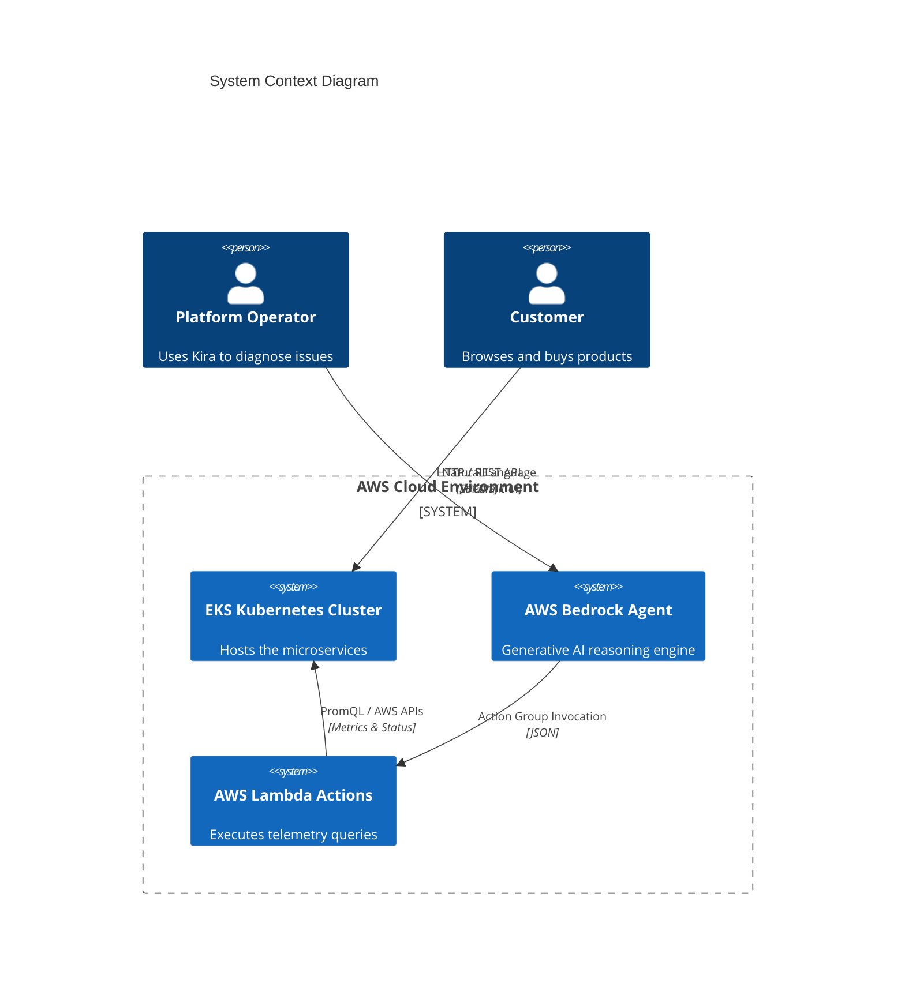
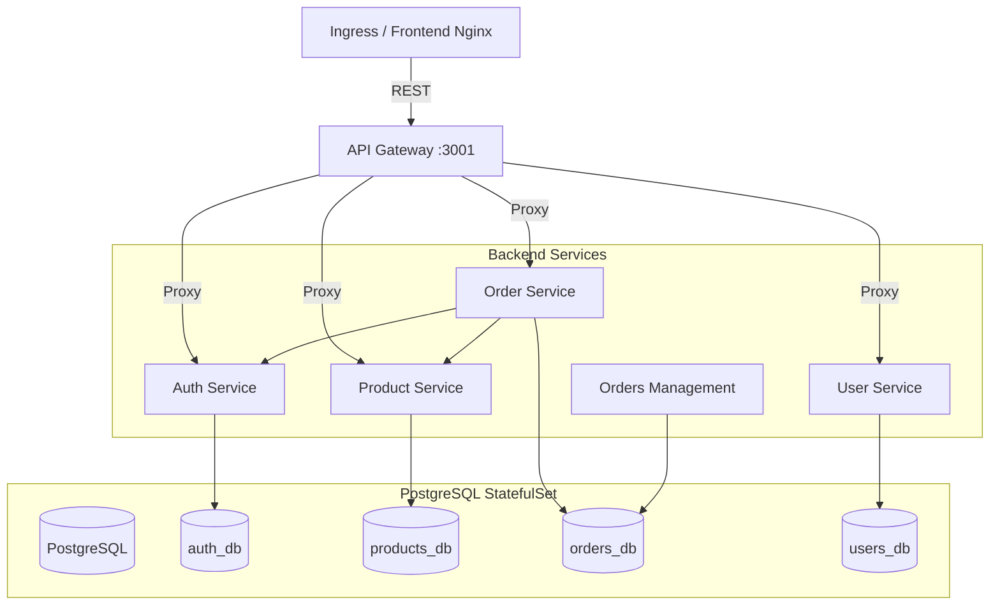
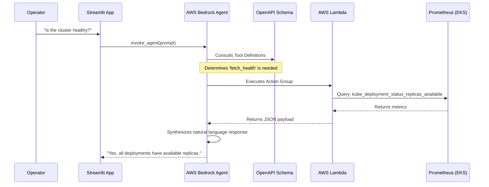

# 🏛️ System Architecture: AIOps E-Commerce Platform

This document provides a deep dive into the architectural design of the AIOps Cloud-Native E-Commerce Platform. The system is designed to be highly available, scalable, observable, and resilient, featuring an integrated Generative AI assistant for automated Root Cause Analysis (RCA).

---

## 1. High-Level System Context

The system consists of three primary domains:
1. **Infrastructure (AWS)**: The underlying cloud resources provisioned via Terraform.
2. **Application Runtime (Kubernetes/EKS)**: The microservices and stateful data stores deployed via GitOps.
3. **AIOps Control Plane (Bedrock/Lambda)**: The AI-driven monitoring and diagnostic system.

---

## 2. Infrastructure Architecture (Terraform)

The infrastructure is codified using Terraform (`/platform/Infrastructure`) and relies on a modular AWS design.

- **VPC Module**: Creates a custom VPC with public subnets (for NAT Gateways and ALBs) and private subnets (where the actual EKS worker nodes run). This ensures the compute plane is not directly exposed to the internet.
- **EKS Module**: Provisions the Kubernetes Control Plane and managed worker node groups. It supports mixed instance types (e.g., `t3.medium`, `t3.large`) to optimize costs.
- **ECR Module**: Provisions private Elastic Container Registries for the `gateway`, `auth`, `product-service`, `order-service`, and `user-service` images.
- **Bootstrapping (Helm)**: Upon EKS creation, Terraform uses the Helm provider to instantly deploy:
  - **ArgoCD**: The GitOps controller.
  - **Kube-Prometheus-Stack**: Installs Prometheus, Grafana, and AlertManager into the `monitoring` namespace.

---

## 3. Microservices Architecture

The core business logic is implemented in Node.js (`/platform/ecommerce-microservices`), running inside the EKS cluster.

### Key Design Patterns:
- **API Gateway Pattern**: The `gateway` service uses `express-http-proxy` to route incoming requests (e.g., `/api/products` -> `http://product-service:3003`). This encapsulates the internal network topology from the client.
- **Database per Service**: While physically sharing a single PostgreSQL StatefulSet to save resources, the data is logically isolated into specific databases (`auth_db`, `products_db`, etc.). Services only have credentials to access their respective logical databases.
- **Custom Metrics**: Every Express microservice is wrapped with a custom `prom-client` middleware (`metricsMiddleware`) that exposes HTTP request durations, status codes, and traffic volumes on a `/metrics` endpoint for Prometheus to scrape.

---

## 4. GitOps Deployment Architecture

The platform strictly adheres to GitOps principles for CI/CD.

1. **GitHub as Source of Truth**: Changes to `/gitops/k8s` in the main branch trigger state changes.
2. **ArgoCD Controller**: Runs inside EKS, continuously polling the GitHub repository.
3. **Kustomize Rendering**: ArgoCD uses the `kustomization.yml` file to generate the final Kubernetes YAML.
4. **Secrets Management**: Sensitive data (like `AUTH_DB_URL`) is managed via Kubernetes Secrets, which are mounted as Environment Variables in the Pods (as seen in `auth.yml`).

---

## 5. AIOps Assistant Architecture (Kira)

The most innovative component is the AI Assistant (`/aiops-assistant`), designed to accelerate incident response.

### Inner Workings:
- **Streamlit**: Provides the chat interface (`app.py`), managing session state and generating unique session IDs for the Bedrock agent.
- **AWS Bedrock**: Acts as the reasoning engine. Given a prompt like "Why are there 503 errors?", it uses an LLM to determine *which* data it needs to fetch to answer the question.
- **OpenAPI Schemas**: The `/schemas/` directory defines exactly what the Lambda functions can do (e.g., `fetch_health.json` describes the inputs and outputs of the health check tool). Bedrock reads these schemas.
- **Lambda Executors**: The actual code (`/lambda/fetch_health/lambda_function.py`) executes Boto3 calls (for AWS API data) and raw HTTP requests to the internal Prometheus server (using PromQL) to gather ground-truth telemetry. It formats this data into a JSON structure that the LLM can interpret.
