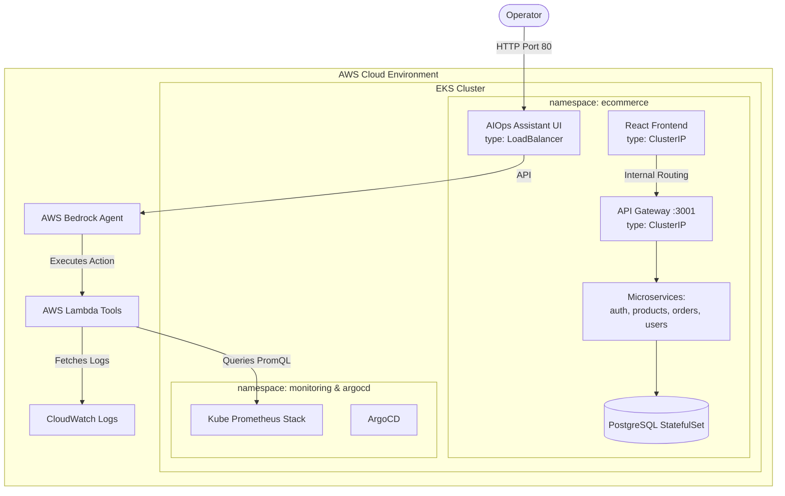

# 🚀 AIOps Cloud-Native E-Commerce Platform

Welcome to the **AIOps Cloud-Native E-Commerce Platform**. This project is a microservices-based web application deployed via GitOps on AWS Elastic Kubernetes Service (EKS).

It features an **integrated Generative AI Operations (AIOps) assistant named Logira**, designed to perform automated Root Cause Analysis (RCA) by querying cluster metrics and logs.

---

## 🏗️ Exact System Architecture


---

## 🏗️ Project Components

### 1. 🤖 AIOps Assistant (`/aiops-assistant`)
The operational assistant used to diagnose cluster issues.
- **Frontend**: A Streamlit chat interface (`app.py`).
- **Intelligence**: AWS Bedrock Agents.
- **Action Capabilities**: AWS Lambda functions (`/lambda/`) that query the EKS API and Prometheus (`fetch_health`, `fetch_logs`, `fetch_metrics`).
- **Exposure**: Deployed to EKS and exposed publicly via an AWS Load Balancer.

### 2. 💻 E-Commerce Microservices (`/platform/ecommerce-microservices`)
The core application stack.
- **Frontend**: React SPA served by an Nginx container.
- **API Gateway**: Node.js/Express proxy (`http-proxy-middleware`).
- **Backend Services**: `auth`, `product-service`, `order-service`, `orders`, `user-service`.
- **Database**: A single PostgreSQL container/StatefulSet.
- **Local Dev**: Fully runnable locally via the provided `docker-compose.yml`.

### 3. ☁️ Infrastructure as Code (`/platform/Infrastructure`)
Terraform code to provision the AWS foundation.
- **VPC & EKS**: Provisions a custom Virtual Private Cloud and an Elastic Kubernetes Service cluster.
- **ECR**: Elastic Container Registries for Docker images.
- **Helm Bootstrapping**: Automatically installs ArgoCD and the `kube-prometheus-stack` onto the cluster post-creation.

### 4. 🔄 GitOps Deployment (`/gitops`)
The Kubernetes deployment manifests.
- **ArgoCD**: The `argo-cd.yml` manifest tracks the Git repository.
- **Kustomize**: The `kustomization.yml` dynamically builds the deployments, services, and network policies for the `ecommerce` namespace.

---

## 🛠️ Getting Started

### 1. Local Development
Run the microservices stack on your machine:
```bash
cd platform/ecommerce-microservices
docker-compose up -d
```

### 2. Cloud Provisioning
Deploy the EKS cluster and monitoring stack:
```bash
cd platform/Infrastructure
terraform init
terraform apply
```

### 3. Running the AIOps Assistant Locally
```bash
cd aiops-assistant
pip install -r requirements.txt
cp .env.example .env
streamlit run app.py
```
