# ⚡ Kira: AIOps Assistant

Kira is a Generative AI-powered operational assistant designed to reduce Mean Time To Resolution (MTTR) by providing a natural language interface for Root Cause Analysis (RCA).

Built with Python and Streamlit, Kira connects to an AWS Bedrock Agent to autonomously query system health, logs, and metrics across your cloud-native infrastructure.

## 🏗️ Assistant Architecture

```mermaid
sequenceDiagram
    participant Operator
    participant UI as Streamlit UI
    participant Bedrock as AWS Bedrock Agent
    participant Lambda as AWS Lambda (Action Group)
    participant Cluster as EKS / Prometheus

    Operator->>UI: "Why are we seeing 503 errors?"
    UI->>Bedrock: Send Prompt (Session ID)
    
    rect rgb(30, 40, 50)
        Note over Bedrock,Lambda: LLM Reasoning Phase
        Bedrock->>Bedrock: Analyzes prompt & OpenAPI Schemas
        Bedrock->>Lambda: Decides to invoke 'fetch_health'
    end
    
    Lambda->>Cluster: Query AWS EKS API (Node Status)
    Lambda->>Cluster: Execute PromQL (kube_pod_container_status_restarts_total)
    Cluster-->>Lambda: Return Cluster State & Metrics
    Lambda-->>Bedrock: Return JSON Action Response
    
    Bedrock->>Bedrock: Formulate human-readable summary
    Bedrock-->>UI: "The product-service pod is crashing..."
    UI-->>Operator: Display Response
```



## Architecture Details

* **Frontend**: Streamlit Chat UI (`app.py`).
* **AI Engine**: AWS Bedrock Agents.
* **Action Groups (Tools)**: AWS Lambda functions (`/lambda/`) that perform the actual work:
  * `fetch_health`: Queries AWS EKS and internal Prometheus via PromQL.
  * `fetch_logs`: Retrieves and parses application logs from CloudWatch.
  * `fetch_metrics`: Pulls specific performance metrics to diagnose issues.
* **Schemas**: OpenAPI specifications (`/schemas/`) defining the contract.

## Prerequisites & Setup

1. **Install Dependencies**:
   ```bash
   pip install -r requirements.txt
   ```

2. **Environment Variables**:
   Copy the example config and fill in your AWS credentials and Bedrock Agent IDs:
   ```bash
   cp .env.example .env
   ```

3. **Deploy IAM Roles & Lambdas**:
   ```bash
   ./setup-iam.sh
   ./deploy.sh
   ```

4. **Run the Assistant**:
   ```bash
   streamlit run app.py
   ```
