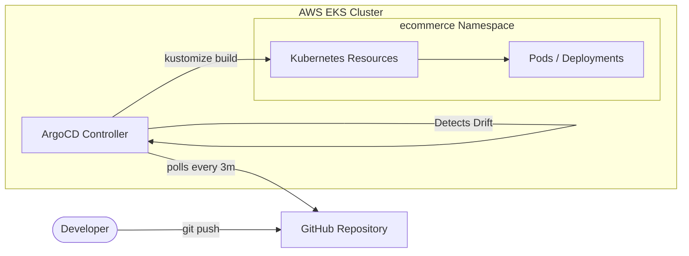

# 🔄 GitOps Deployment

This directory contains the Kubernetes manifests used to deploy the entire E-Commerce application and monitoring stack using a GitOps methodology. 

We use **ArgoCD** as our GitOps controller and **Kustomize** to dynamically render our deployment manifests.

## 🏗️ GitOps Architecture Flow



## Structure

* **`argo-cd.yml`**: The ArgoCD `Application` Custom Resource Definition (CRD). This tells ArgoCD to watch the `gitops` directory in our GitHub repository and deploy it to the `ecommerce` namespace.
* **`kustomization.yml`**: The root Kustomize file that aggregates all our resources.
* **`k8s/`**: Directory containing all base and overlaid Kubernetes manifests:
  * `/backend`: Deployments, Services, and ServiceMonitors for the Node.js microservices.
  * `/database`: StatefulSet and Service for PostgreSQL.
  * `/frontend`: Deployment for the React/Nginx frontend.
  * `assistant-*.yml`: Deployments and NetworkPolicies for the AIOps assistant.
  * `grafana-dashboard.yml`: ConfigMap containing our custom Grafana JSON dashboard.

## Applying Manually

While ArgoCD is meant to automate this, if you need to apply these manually (or test your Kustomize build), you can run:

```bash
kubectl apply -k .
```
*(This command uses the `kustomization.yml` file in the current directory)*
