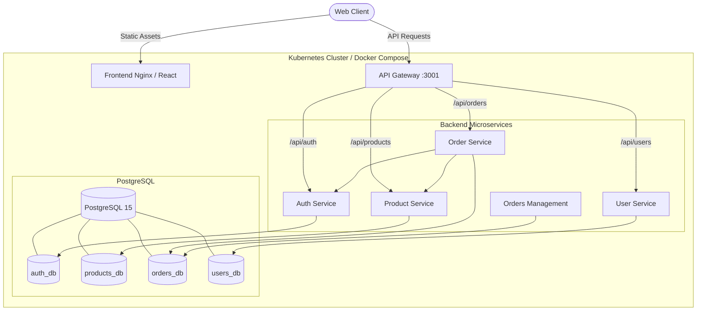

# Platform & Infrastructure

This directory contains the core application stack and the Infrastructure as Code (IaC) required to provision its cloud environment.

## 🏗️ Microservices Architecture



## Directory Structure

### 1. `ecommerce-microservices/`
The full-stack e-commerce application.
- **Backend Services**: A Node.js/Express microservices architecture.
- **Frontend**: A React SPA served by Nginx.
- **Database**: PostgreSQL (handling logical isolation).
- **Observability**: Custom metrics exposed via `prom-client` middleware.

### Service Registry & Ports

| Service | Port | Role |
|---------|------|------|
| Frontend | 3000 | React UI |
| Gateway | 3001 | Routes all client requests to backend services |
| Auth | 3002 | Login and registration |
| Product Service | 3003 | Product catalog and inventory |
| Order Service | 3004 | Cart and checkout |
| Orders | 3005 | Order history and management |
| User Service | 3006 | User profiles and account management |
| PostgreSQL | 5432 | Stores auth_db, products_db, orders_db, users_db |
| Prometheus | 9090 | Metrics collection |
| Grafana | 8080 | Metrics dashboards |

**Local Development**:
```bash
cd ecommerce-microservices
docker-compose up -d
```

### 2. `Infrastructure/`
Terraform configurations for provisioning the AWS cloud environment.
- **VPC (`modules/vpc`)**: Custom network topology.
- **EKS (`modules/eks`)**: Elastic Kubernetes Service cluster.
- **ECR (`modules/ecr`)**: Container registries.
- **ArgoCD & Monitoring Bootstrap (`modules/argocd`)**: Automatically deploys ArgoCD and `kube-prometheus-stack`.

**Provisioning Infrastructure**:
```bash
cd Infrastructure
terraform init
terraform apply
```
